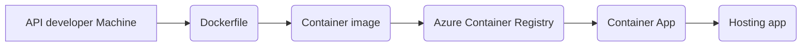

# Infractructure for weather application

### Prerequisities

First of all I created API key from my account on `https://openweathermap.org/` and created the link directly to my trigger: 

[openweathermap](http://api.openweathermap.org/data/2.5/weather?q={APIkey})

I paste it in firefox and the program returned syntax in json:

### Docker

Before starting the task related to Docker, I had to perform the following actions.\
On my localhost I created eficode folder.\
In`~/eficode/weatherapp/frontend` and `~/eficode/weatherapp/backend` I used command:\
`npm i && npm start`.\
Then in `~/eficode/weatherapp/frontend` and `~/eficode/weatherapp/backend` I created `Dockerfile's` and `do` files as script to create docker.\
Next in `~/eficode/weatherapp/` I created `docker-compose.yml` which can run a both of containers.\
I include in `docker-compose.yml` required information about volumes I used:\
`npm run` for frontend and backend are enabling hot reload.

### NODE and REACT development

To realize report the forecast e.g. a few hours from now I changed link to:
http://api.openweathermap.org/data/2.5/forecast?lon=19.46&lat=51.75&hourly=1&=Lodz&appid={API key}.

### Testing

In fronted and backend API had much vulnerabilities and in consequences I used:\
`npm audit fix --force` to up to date backend and frontend.

To work mocha properly, I needed to install additionally:\
`npm install -g mocha --save-dev` in current folder frontend & backend\
`node node_modules/.bin/mocha --version` mocha version\
`npm install axios` required module for mocha

Then in folder `testing` I have created a `openweathermap.test.js` whch is checking valid city and return result of the test (screen in testing folder).\
Execute command:\
`npx mocha openweathermap.test.js`.

### Cloud

The First thing what I did was building three containers with equivalent command:\
`docker build -t weatherapp-backend:latest`\
`docker build -t weatherapp-frontend:latest`\
`docker build -t weather-data-provider:latest`

When creating the infrastructure for a weather application, I decided to use a serverless solution.\
To set up the weather service I have been choosen Azure portal. On my account I have been created resource group named `eficode`.\
In this resource group i created Container registry `openweathermap`.\
Locally, in te terminal, I executed several commands:\
`docker login operweathermap.azurecr.io`\
then execute tag & upload existing, local containers to the Azure Container registry:\
`docker tag weatherapp-backend openweathermap.azurecr.io/weatherapp-backend:latest`\
`docker push openweathermap.azurecr.io/weatherapp-backend:latest`\
`docker tag weatherapp-frontend openweathermap.azurecr.io/weatherapp-frontend:latest`\
`docker push openweathermap.azurecr.io/weatherapp-frontend:latest`\
`docker tag weather-data-provider openweathermap.azurecr.io/weather-data-provider:latest`\
`docker push openweathermap.azurecr.io/weather-data-provider:latest`

In Azure Container Apps service I created three container apps. I am hosting them on links below:\
`https://containerapp.purplegrass-e2305b4d.eastus.azurecontainerapps.io/` as weather-fronetend\
`https://wbackend.internal.purplegrass-e2305b4d.eastus.azurecontainerapps.io/` as weather-backend\
`https://wdataprovider.purplegrass-e2305b4d.eastus.azurecontainerapps.io/` as weather-data-provider

Before previous step I created Container Apps Environment service with name `managedEnvironment-eficode-acf6` where I see that three container apps (screen on weatherapp folder).  

### Ansible

I created `ansible.yml` file which automatically install on local machine the following services:\
  `Docker & start docker service`\
  `weather application`\
  `mocha` for testing.

I would like to propose an additional automation, whis is the automatic installation and starting of a container with Ubuntu 20.04 on the Proxmox virtualizer using:\
`ansible-playbook -i hosts ansible2.yml`.

Then, by running necessary preliminary commands:\
`apt-get install ansible -y`\
`apt-get install python3-pip -y`\
`apt-get install python3-venv -y`\
`python3 -m venv venv`\
`pip install ansible -y`\
`source venv/bin/activate`\
to start the ansible playbook:\
`ansible-playbook ansible1.yml -vvv`
can be executed to install the remaining services.
  
Thank you for your time.
